# Code Structure

```mermaid
flowchart TD
  subgraph CLI[src/index.ts]
    CInit[initializeDatabase]
    CHelp[printHelp]
    CTodoCmd[dispatch todo subcommands]
    CTagCmd[dispatch tag]
    CExportCmd[dispatch export]
  end

  subgraph Commands[src/commands/*]
    CmdAdd[runAddCommand]
    CmdDelete[runDeleteCommand]
    CmdGet[runGetCommand]
    CmdTag[runTagCommand]
    CmdExport[runExportCommand]
    CmdShared[parsePositiveInteger / parseIdsList / parseDateString / parsePriority / parseBooleanString]
    CmdMarkdown[toMarkdown / renderTagMarkdown / renderTodoMarkdown]
  end

  subgraph DBInit[src/db/index.ts + src/db/pragmas.ts]
    DEnsure[ensureConfigDir]
    DPragma[applySqlitePragmas]
    DInit[initializeDatabase]
    DRunMig[migrate with drizzle folder]
  end

  subgraph Schema[src/db/schema.ts]
    STags[tagsTable]
    STodos[todosTable]
    SDeps[todoDependenciesTable]
  end

  subgraph QIndex[src/db/queries/index.ts]
    QBarrel[re-export query modules]
  end

  subgraph QTodos[src/db/queries/todos.ts]
    QTSelect[todosWithBlockedSelection]
    QTMap[mapBlocked]
    QTBlockedExpr[blockedExistsSql]
    QTCreate[createTodo]
    QTGetById[getTodoById]
    QTGetAll[getTodos]
    QTUpdate[updateTodo]
    QTDelete[deleteTodo]
    QTReady[getReadyTodos]
    QTByIds[getTodosByIds]
    QTNext[getNextTodos]
    QTForGet[getTodosForGet]
    QTAdd[addTodo]
    QTSort[compareTodosForScheduling]
  end

  subgraph QTags[src/db/queries/tags.ts]
    QGCreate[createTag]
    QGById[getTagById]
    QGAll[getTags]
    QGUpdate[updateTag]
    QGDelete[deleteTag]
    QGPath[ensureTagPath]
    QGFind[findTagByNameAndParent]
    QGNorm[normalizeTagPath]
  end

  subgraph QDeps[src/db/queries/dependencies.ts]
    QDAdd[addDependency]
  end

  subgraph QExport[src/db/queries/export.ts]
    QEGet[getExportTree]
    QEBuildTags[tagNodes + sortTagTree]
    QEBuildTodos[todoNodes + dependency tree]
  end

  Migrations[drizzle/*.sql\nDDL + constraints + triggers]
  Tests[test/db.test.ts + test/commands/add.test.ts + test/commands/delete.test.ts + test/commands/get.test.ts + test/commands/tag.test.ts\nintegration tests]

  CInit --> DInit
  DInit --> DEnsure
  DInit --> DPragma
  DInit --> DRunMig
  DRunMig --> Migrations

  CTodoCmd --> CmdAdd
  CTodoCmd --> CmdDelete
  CTodoCmd --> CmdGet
  CTagCmd --> CmdTag
  CExportCmd --> CmdExport

  CmdAdd --> CmdShared
  CmdDelete --> CmdShared
  CmdGet --> CmdShared
  CmdTag --> CmdShared
  CmdExport --> CmdMarkdown

  CmdAdd --> QTAdd
  CmdDelete --> QTDelete
  CmdTag --> QGPath
  CmdTag --> QGUpdate
  CmdTag --> QGDelete
  QTAdd --> QTCreate
  QTAdd --> QTGetById
  QTAdd --> QDAdd
  QTAdd --> QGPath

  CmdGet --> QTByIds
  CmdGet --> QTForGet
  QTForGet --> QTSelect
  QTByIds --> QTSelect
  QTGetById --> QTSelect
  QTGetAll --> QTSelect
  QTSelect --> QTBlockedExpr
  QTSelect --> QTMap
  QTForGet --> QTSort
  QTNext --> QTForGet

  CmdExport --> QEGet
  QEGet --> QGAll
  QEGet --> QTGetAll
  QEGet --> QEBuildTags
  QEGet --> QEBuildTodos

  QTCreate --> STodos
  QTGetById --> STodos
  QTGetAll --> STodos
  QTUpdate --> STodos
  QTDelete --> STodos
  QTReady --> STodos
  QTBlockedExpr --> SDeps
  QTBlockedExpr --> STodos
  QGCreate --> STags
  QGById --> STags
  QGAll --> STags
  QGUpdate --> STags
  QGDelete --> STags
  QDAdd --> SDeps

  QBarrel --> QTodos
  QBarrel --> QTags
  QBarrel --> QDeps
  QBarrel --> QExport

  Tests --> DInit
  Tests --> QTodos
  Tests --> QTags
  Tests --> QDeps
  Tests --> QExport
  Tests --> Migrations
```

## Notes

- CLI orchestration/dispatch lives in `src/index.ts`; command-specific logic is split under `src/commands/*`.
- Shared CLI option parsing/validation is centralized in `src/commands/shared.ts`.
- Scheduling behavior is centralized in `compareTodosForScheduling` and reused by `getNextTodos`/`getTodosForGet`.
- Todo blocked-state selection is centralized in `todosWithBlockedSelection` and reused by `getTodoById`/`getTodos`/`getTodosByIds`/`getTodosForGet`.
- Tag path upsert is centralized in `ensureTagPath` and reused by `addTodo`.
- Migration SQL (`drizzle/*.sql`) is part of runtime startup via `initializeDatabase`, so first run initializes schema.
