# Code Structure

```mermaid
flowchart TD
  subgraph CLI[src/index.ts]
    CInit[initializeDatabase]
    CAssert[assertDatabaseInitialized]
    CRoot[build root Command + parse]
    CTodo[createTodoCommand]
    CTag[createTagCommand]
    CExport[createExportCommand]
    CInitCmd[createInitCommand]
  end

  subgraph Commands[src/commands/*]
    CmdTodoShell[src/commands/todos/command.ts]
    CmdTagShell[src/commands/tags/command.ts]
    CmdExportShell[src/commands/export/command.ts]
    CmdInitShell[src/commands/init/command.ts]
    CmdAdd[runAddCommand]
    CmdDelete[runDeleteCommand]
    CmdUpdate[runUpdateCommand]
    CmdGet[runGetCommand]
    CmdTagAdd[runTagAddCommand]
    CmdTagGet[runTagGetCommand]
    CmdTagUpdate[runTagUpdateCommand]
    CmdTagDelete[runTagDeleteCommand]
    CmdExport[runExportCommand]
    CmdInit[runInitCommand]
    CmdShared[parsePositiveInteger / parsePriority]
    CmdTypes[dateYmdType / tagPathType]
    CmdMarkdown[toMarkdown / renderTagMarkdown / renderTodoMarkdown]
  end

  subgraph DBInit[src/db/index.ts + src/db/pragmas.ts]
    DEnsure[ensureConfigDir]
    DPragma[applySqlitePragmas]
    DInit[initializeDatabase]
    DAssert[assertDatabaseInitialized]
    DRunMig[migrate with drizzle folder]
  end

  subgraph DevScripts[scripts/db-squash.ts]
    SSql[removeFilesInDirectory]
    SGen[drizzle-kit generate]
    SAppend[appendCustomMigrationSql]
    SMigrate[drizzle-kit migrate]
  end

  subgraph Schema[src/db/schema.ts]
    STags[tagsTable]
    STodos[todosTable]
    SDeps[todoDependenciesTable]
  end

  subgraph QIndex[src/db/queries/index.ts]
    QBarrel[re-export query modules]
  end

  subgraph QTodos[src/db/queries/todos.ts]
    QTSelect[todosWithBlockedSelection]
    QTMap[mapBlocked]
    QTBlockedExpr[blockedExistsSql]
    QTCreate[createTodo]
    QTGetById[getTodoById]
    QTGetAll[getTodos]
    QTUpdate[updateTodo]
    QTDelete[deleteTodo]
    QTReady[getReadyTodos]
    QTByIds[getTodosByIds]
    QTNext[getNextTodos]
    QTForGet[getTodosForGet]
    QTAdd[addTodo]
    QTUpdateRel[updateTodoWithRelations]
    QTSort[compareTodosForScheduling]
  end

  subgraph QTags[src/db/queries/tags.ts]
    QGCreate[createTag]
    QGById[getTagById]
    QGAll[getTags]
    QGAllSummary[getAllTagsSummary]
    QGResolve[resolveTagPath]
    QGSummary[getTagSummary]
    QGUpdate[updateTag]
    QGDelete[deleteTag]
    QGPath[ensureTagPath]
    QGFind[findTagByNameAndParent]
    QGNorm[normalizeTagPath]
  end

  subgraph QDeps[src/db/queries/dependencies.ts]
    QDAdd[addDependency]
    QDReplace[replaceTodoPredecessors]
  end

  subgraph QExport[src/db/queries/export.ts]
    QEGet[getExportTree]
    QEBuildTags[tagNodes + sortTagTree]
    QEBuildTodos[todoNodes + dependency tree]
  end

  Migrations[drizzle/*.sql\nDDL + constraints + triggers]
  Tests[test/db.test.ts + test/commands/add.test.ts + test/commands/update.test.ts + test/commands/delete.test.ts + test/commands/get.test.ts + test/commands/tag.test.ts\nintegration tests]

  CInit --> DInit
  CAssert --> DAssert
  CRoot --> CTodo
  CRoot --> CTag
  CRoot --> CExport
  CRoot --> CInitCmd
  CTodo --> CmdTodoShell
  CTag --> CmdTagShell
  CExport --> CmdExportShell
  CInitCmd --> CmdInitShell
  CmdTodoShell --> CmdAdd
  CmdTodoShell --> CmdGet
  CmdTodoShell --> CmdUpdate
  CmdTodoShell --> CmdDelete
  CmdTagShell --> CmdTagAdd
  CmdTagShell --> CmdTagGet
  CmdTagShell --> CmdTagUpdate
  CmdTagShell --> CmdTagDelete
  CmdExportShell --> CmdExport
  CmdInitShell --> CmdInit

  DInit --> DEnsure
  DInit --> DPragma
  DAssert --> DRunMig
  CmdInit --> DRunMig
  DRunMig --> Migrations

  SSql --> SGen
  SGen --> SAppend
  SAppend --> SMigrate
  SAppend --> Migrations

  CmdAdd --> CmdShared
  CmdAdd --> CmdTypes
  CmdUpdate --> CmdShared
  CmdUpdate --> CmdTypes
  CmdDelete --> CmdShared
  CmdGet --> CmdShared
  CmdGet --> CmdTypes
  CmdTagAdd --> CmdTypes
  CmdTagGet --> CmdShared
  CmdTagUpdate --> CmdShared
  CmdTagDelete --> CmdShared
  CmdExport --> CmdMarkdown

  CmdAdd --> QTAdd
  CmdUpdate --> QTUpdate
  CmdUpdate --> QTUpdateRel
  CmdUpdate --> QGResolve
  CmdUpdate --> QGById
  CmdDelete --> QTDelete
  CmdTagAdd --> QGPath
  CmdTagGet --> QGAllSummary
  CmdTagGet --> QGSummary
  CmdTagUpdate --> QGUpdate
  CmdTagDelete --> QGDelete
  CmdTagDelete --> QGById
  QTAdd --> QTCreate
  QTAdd --> QTGetById
  QTAdd --> QDAdd
  QTAdd --> QGPath
  QTUpdateRel --> QTUpdate
  QTUpdateRel --> QTGetById
  QTUpdateRel --> QDReplace

  CmdGet --> QTByIds
  CmdGet --> QTForGet
  CmdGet --> QGResolve
  CmdGet --> QGById
  QTForGet --> QTSelect
  QTByIds --> QTSelect
  QTGetById --> QTSelect
  QTGetAll --> QTSelect
  QTSelect --> QTBlockedExpr
  QTSelect --> QTMap
  QTForGet --> QTSort
  QTNext --> QTForGet

  CmdExport --> QEGet
  QEGet --> QGAll
  QEGet --> QTGetAll
  QEGet --> QEBuildTags
  QEGet --> QEBuildTodos

  QTCreate --> STodos
  QTGetById --> STodos
  QTGetAll --> STodos
  QTUpdate --> STodos
  QTDelete --> STodos
  QTReady --> STodos
  QTBlockedExpr --> SDeps
  QTBlockedExpr --> STodos
  QGCreate --> STags
  QGById --> STags
  QGAll --> STags
  QGUpdate --> STags
  QGDelete --> STags
  QDAdd --> SDeps
  QDReplace --> SDeps

  QBarrel --> QTodos
  QBarrel --> QTags
  QBarrel --> QDeps
  QBarrel --> QExport

  Tests --> DInit
  Tests --> CmdInit
  Tests --> QTodos
  Tests --> QTags
  Tests --> QDeps
  Tests --> QExport
  Tests --> Migrations
```

## Notes

- Cliffy root setup and parse flow live directly in `src/index.ts`.
- `sb init` is the explicit migration entrypoint; normal command execution checks migration state first.
- Commands are grouped by domain under `src/commands/todos/*`, `src/commands/tags/*`, and `src/commands/export/*`.
- Shared CLI option parsing/validation is centralized in `src/commands/shared.ts`.
- Cliffy option primitives (`required`, `default`, built-in types, and enum/custom types) are preferred for CLI parsing and help metadata, with `shared.ts` reserved for domain-specific validators.
- Scheduling behavior is centralized in `compareTodosForScheduling` and reused by `getNextTodos`/`getTodosForGet`.
- Todo blocked-state selection is centralized in `todosWithBlockedSelection` and reused by `getTodoById`/`getTodos`/`getTodosByIds`/`getTodosForGet`.
- Tag path upsert is centralized in `ensureTagPath` and reused by `addTodo`.
- Migration SQL (`drizzle/*.sql`) is applied by `sb init` (via `runMigrations`), not by default command startup.
